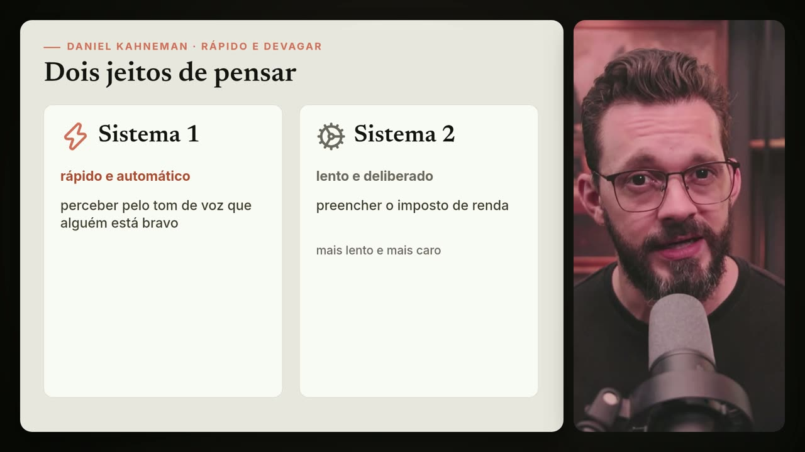
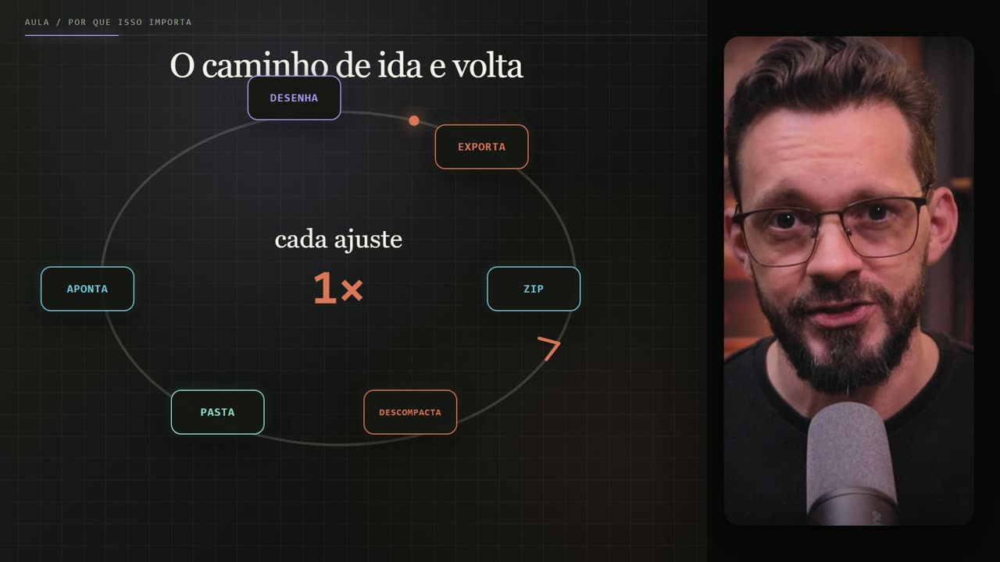

# Studio

**Edite seus vídeos conversando com o Claude.** Você grava e corta; o Claude assiste, entende o que você fala e monta a edição: textos animados, prints com zoom e marca-texto, tela dividida, gráficos, legendas e, se quiser, B-rolls gerados por IA.

| | | |
|---|---|---|
|  |  |  |

O arquivo [CLAUDE.md](CLAUDE.md) transforma o Claude num **diretor de vídeo**: ao abrir o projeto, ele pergunta em qual nível você quer editar, confere o que falta instalar, sugere estilos e conduz cada etapa, parando para você aprovar.

## Dois níveis

| | **Nível 1: gratuito** | **Nível 2: avançado** |
|---|---|---|
| Motor | [Remotion](https://www.remotion.dev) (vídeo feito com código) | [Higgsfield](https://higgsfield.ai) (IA generativa + editor Higgsedit) |
| O que faz | textos, prints animados, marca-texto, tela dividida, gráficos, legendas, transições | tudo do Nível 1 + imagens e vídeos gerados por IA: B-roll, metáforas, cenas realistas |
| Custo | zero, roda no seu computador | créditos da sua conta Higgsfield |
| Melhor para | tutoriais, aulas, análises, notícias, Reels | vídeos que pedem imagem de cinema e ilustração |
| Guia | [guias/2-nivel-1-remotion.md](guias/2-nivel-1-remotion.md) | [guias/4-nivel-2-higgsfield.md](guias/4-nivel-2-higgsfield.md) |

Nos dois níveis o fluxo é o mesmo:

```text
você grava e corta → salva o vídeo e os prints em projetos/
   → o Claude assiste e transcreve (com o tempo de cada palavra)
   → propõe um plano de edição → você aprova
   → ele produz, mostra quadros de revisão → você aprova
   → o vídeo final sai em edicoes/
```

## Começo rápido

Precisa de: Claude com Claude Code (Desktop, VS Code ou terminal), Node.js, Python 3.10+ e FFmpeg. O passo a passo completo, com os comandos de instalação para Windows e Mac, está em **[guias/1-primeiros-passos.md](guias/1-primeiros-passos.md)**.

```bash
git clone https://github.com/mackswendhell/studio.git
cd studio
npm install
pip install faster-whisper
npx skills add remotion-dev/skills
```

Instale também a skill [watch](https://github.com/bradautomates/claude-video) (no Claude Code: `/plugin marketplace add bradautomates/claude-video` e `/plugin install watch@claude-video`).

Depois:

1. Coloque seu vídeo em `projetos/001. meu-video/video/` e os prints em `projetos/001. meu-video/prints/`.
2. Abra a pasta `studio` no Claude (sessão **Code**).
3. Responda se quer o Nível 1 ou o Nível 2 e diga o que imagina. O diretor cuida do resto.

> **Dica que mais faz diferença:** tire print de tudo o que você cita no vídeo (sites, notícias, telas, gráficos) e salve em `prints/`. Animação feita sobre print real fica muito melhor que recriação.

## Estrutura

```text
studio/
├─ CLAUDE.md      o diretor de vídeo
├─ guias/         os manuais, do zero ao avançado
├─ estilos/       galeria de estilos de referência (horizontais e verticais)
├─ projetos/      ← você coloca o vídeo e os prints aqui
├─ edicoes/       ← o vídeo pronto sai aqui
├─ src/           código do Remotion (exemplos de estilo + seus vídeos)
└─ tools/         transcrição local e gerador da Higgsfield Cloud API
```

A explicação pasta por pasta está nos [primeiros passos](guias/1-primeiros-passos.md#7-entendendo-as-pastas).

## Guias

1. [Primeiros passos](guias/1-primeiros-passos.md): instalação, pastas e primeira edição.
2. [Nível 1: Remotion](guias/2-nivel-1-remotion.md): o processo gratuito, fase por fase.
3. [Manual do Remotion para leigos](guias/3-manual-remotion.md): o que é, como funciona e tudo o que dá para pedir.
4. [Nível 2: Higgsfield](guias/4-nivel-2-higgsfield.md): como conectar (conta ou API key), processo, modelos, custos e prompts.
5. [Direção editorial](guias/5-direcao-editorial.md): o repertório de cenas, transições e cuidados que guia toda edição.

E a [galeria de estilos](estilos/README.md) para escolher o visual.

## Créditos e licenças

- Código e guias deste repositório: [MIT](LICENSE).
- As imagens em `estilos/imagens/` que vêm de vídeos do canal **Macks Wendhell | Inteligência Aplicada** são referência visual; não as reutilize como material próprio.
- [Remotion](https://www.remotion.dev): gratuito para pessoas físicas, organizações sem fins lucrativos e empresas com até 3 pessoas; empresas maiores precisam de [licença](https://www.remotion.dev/license).
- Skill [watch](https://github.com/bradautomates/claude-video), de bradautomates (MIT).
- Skills do Remotion: [remotion-dev/skills](https://github.com/remotion-dev/skills).
- Transcrição: [faster-whisper](https://github.com/SYSTRAN/faster-whisper).
- Higgsfield: serviço de terceiros, sujeito aos termos e preços da [Higgsfield](https://higgsfield.ai).
