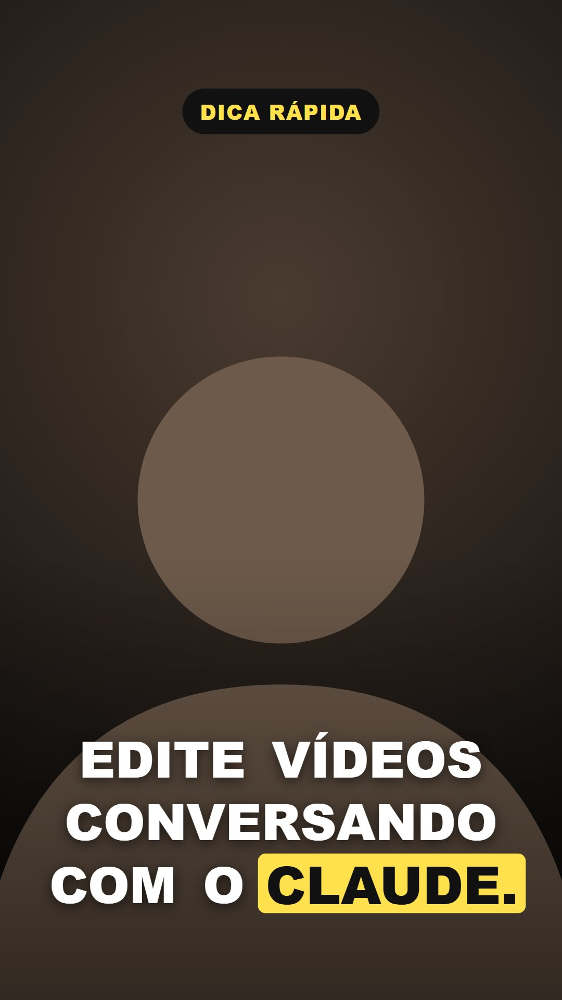
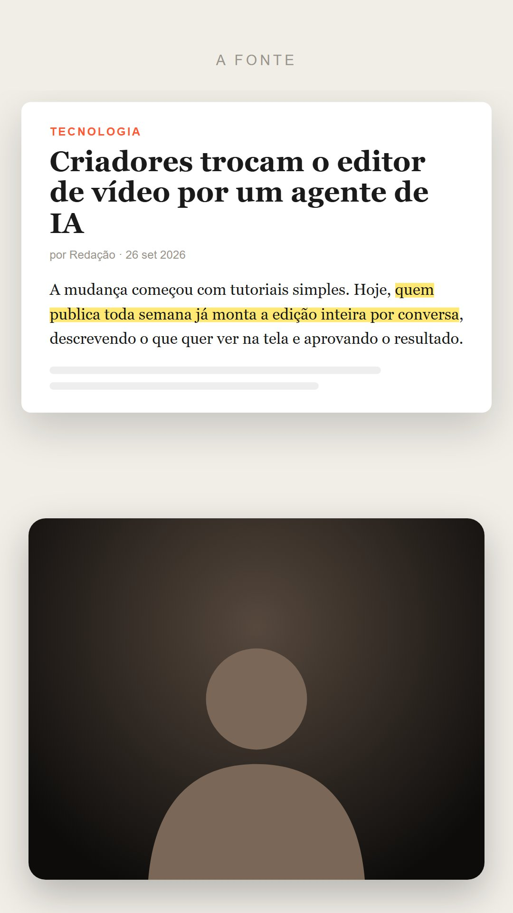
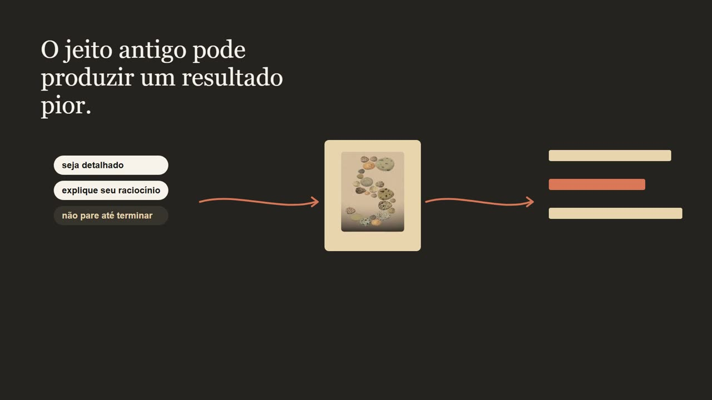
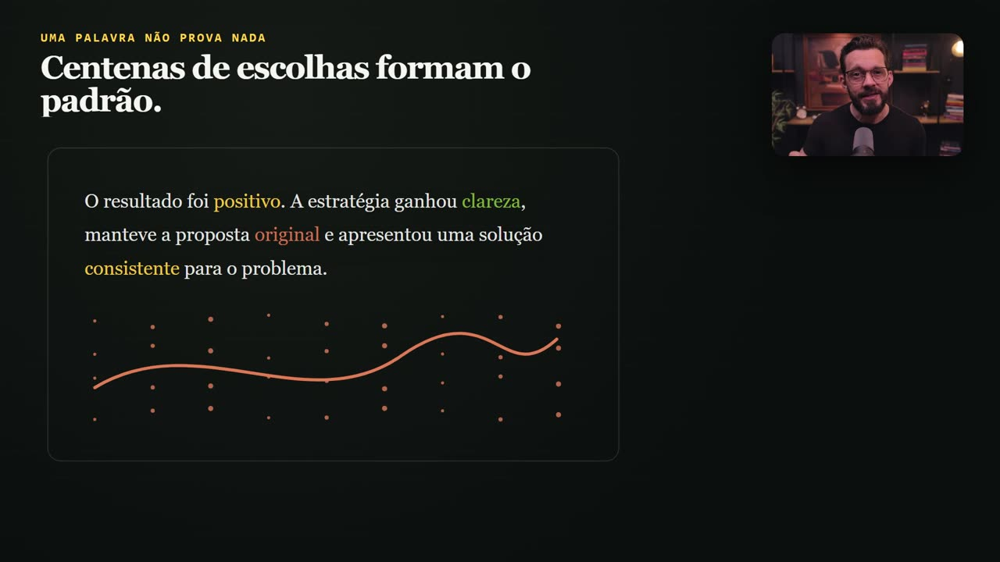
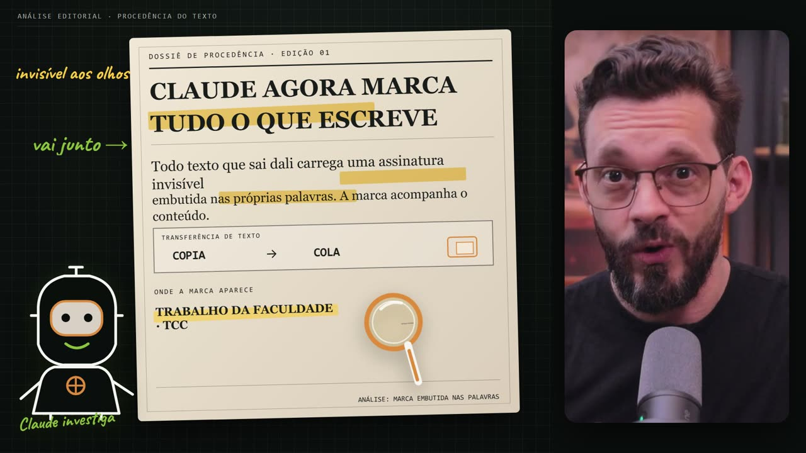
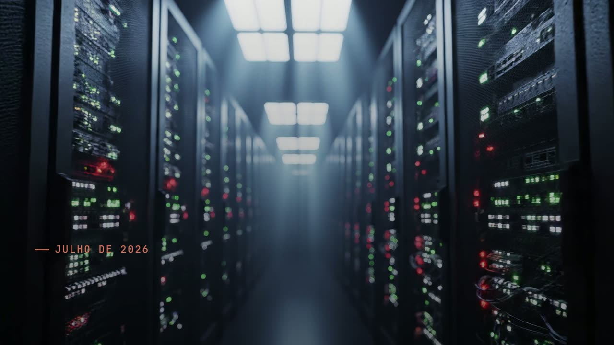

# Galeria de estilos

Referências para você escolher (ou misturar) antes de editar. **Nenhum estilo é obrigatório.** Diga ao Claude qual te agrada, peça variações ("o minimal suíço, mas com fundo escuro") ou traga as suas próprias referências: salve prints de vídeos, sites ou marcas que você admira em `prints/` e peça "segue o estilo destas imagens".

Na conversa, basta citar o nome do estilo em negrito.

---

## Exemplos que rodam no seu computador

Estes cinco vêm com código em [src/estilos/](../src/estilos/). Abra `npm run studio` para vê-los em movimento. A silhueta cinza marca onde entra a **sua câmera**.

### Horizontal (16:9)

| | |
|---|---|
|  |  |
| **Minimal suíço.** Fundo branco, tipografia pesada, grade e um único vermelho. Tela dividida com a câmera à direita, entrando junto com o painel. Bom para aulas e passo a passo. | **Terminal técnico.** Fundo escuro com grade fina, fonte mono, texto digitado em tempo real, câmera em card com brilho. Bom para programação, IA e ferramentas. |

### Vertical (9:16) para Reels, TikTok e Shorts

| | | |
|---|---|---|
|  |  |  |
| **Legenda dinâmica.** Câmera cheia, legenda grande palavra por palavra, a palavra falada em destaque. | **Print com marca-texto.** O print em cima dá zoom e o marca-texto passa sobre a frase citada; câmera embaixo. | **Dados leves.** Gradiente claro, número que conta até o valor falado, barras que crescem; câmera em círculo. |

---

## Do projeto original: Nível 1 (Remotion)

Quadros reais de vídeos editados com este fluxo no canal **Macks Wendhell | Inteligência Aplicada**. São **um** jeito de fazer, não o padrão.

| | |
|---|---|
|  |  |
| **Lousa a giz.** Quadro escuro, traço de giz e letra manuscrita, como um professor escrevendo enquanto explica. Câmera em card à esquerda. | **Editorial quente.** Tons de papel e grafite, serifa elegante, fluxos com setas finas e ilustrações de acervo. |
|  |  |
| **Dossiê claro-escuro.** Alterna folhas claras e fundos escuros, rótulos em caixa alta, câmera pequena no canto. Bom para análises e investigações. | **Técnico neon.** Escuro com contornos em verde e laranja, diagramas circulares, câmera à direita. |
|  |  |
| **Manuscrito colorido.** Elementos sobre a câmera cheia, números em blocos coloridos e anotações à mão. | **Dossiê com marca-texto.** Documento de papel, lupa, marca-texto amarelo e um mascote desenhado. |

## Do projeto original: Nível 2 (Higgsfield)

| | |
|---|---|
|  |  |
| **Papel recortado.** B-roll gerado na Higgsfield como diorama de papel, sem texto; os chips entram na montagem. | **Papel creme em aula.** Painel creme à esquerda, câmera à direita (70/30), cards que se montam com a fala. |
|  | |
| **Cinematográfico escuro.** B-roll realista, luz baixa, tipografia discreta. | |

---

## Como pedir um estilo

```text
Usa o estilo "terminal técnico", intensidade equilibrada.
```

```text
Mistura o "papel creme em aula" com a legenda dinâmica, em vertical.
```

```text
Coloquei 3 prints do canal X em prints/referencia-*. Segue esse visual.
```
